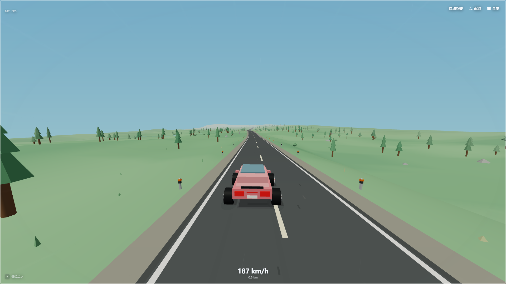
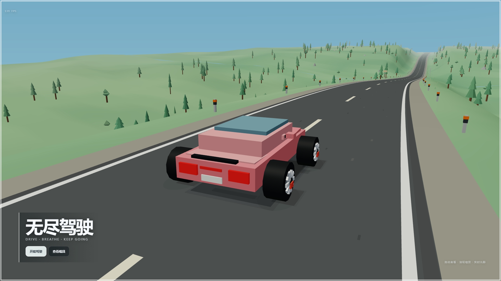
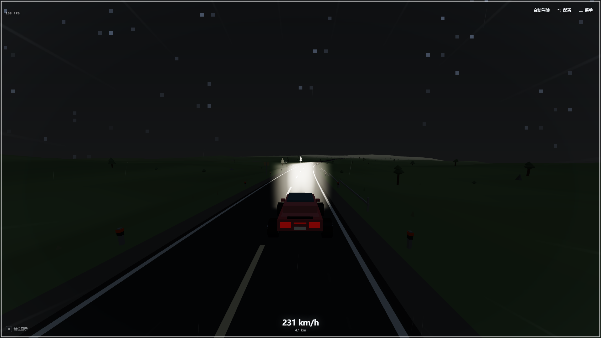
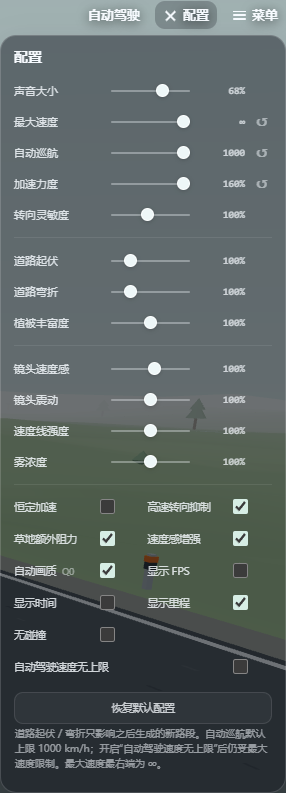

# 无尽驾驶

一个轻松、安静、适合放空的 **3D 程序化无尽驾驶网页游戏**。

整个游戏本体只有一个 `index.html`：不需要 Node.js、npm、本地服务器或联网，下载后使用 Windows 上的 Chrome / Edge 双击即可游玩。

<p align="center">
  <strong><a href="https://eliyork.github.io/endless-drive/">▶ 在线试玩</a></strong>
  &nbsp;·&nbsp;
  单 HTML / 完全离线可运行
</p>

<p align="center">
  
</p>

> 没有比赛，没有任务，没有压力——开着车，一直往前。

## 特点

- 单文件 `index.html`，完全离线运行
- 原生 WebGL2 渲染，无 Three.js / Babylon.js / CDN
- 程序化无尽公路、地形、植被与环境物体
- 固定 Seed（种子）世界，可输入相同 Seed 复现同一世界
- Floating Origin（浮动原点）与 Chunk Recycling（区块循环利用）
- 晴天、黄昏、夜晚、雾天环境模式
- 夜间双前灯、道路白线 / 反光柱逆反射、刹车灯地面反射
- Low Poly 程序化车辆、四轮接地、悬挂、轮胎旋转与前轮转向
- 轻量侧滑、手刹漂移、胎痕、轮胎烟与草地飞尘
- 实时方向投影车影与轮胎接触阴影
- 主界面车辆展示，可拖动环绕、滚轮缩放
- 驾驶 / 暂停与车辆展示镜头平滑过渡
- 自动前进与独立自动驾驶
- 自动驾驶包含道路边缘感知、轨迹预测、前视控制与制动预判
- PC 与移动端横屏操作布局
- 自动画质、FPS 显示与大量可调参数

## 游戏画面

### 车辆展示

<p align="center">
  
</p>

启动游戏后可以环绕查看当前车辆；车灯、车漆高光和方向阴影均为实时生成。

### 夜间驾驶

<p align="center">
  
</p>

夜晚环境会明显变暗，主要依靠车辆前灯照亮道路；白线与路边反光设施会在灯光扫过时增强可见度。

### 自定义配置

<p align="center">
  
</p>

最大速度、自动巡航、道路起伏、道路弯折、植被、镜头与多种驾驶 / 画面选项都可以直接调整。

## 文件结构

```text
index.html
README.md
screenshots/
├─ 01-garage.webp
├─ 02-driving.webp
├─ 03-night-driving.webp
└─ 04-settings.webp
```

其中 **游戏运行只需要 `index.html`**。

`screenshots/` 仅用于 GitHub README 展示，不是游戏资源，也不会被 `index.html` 加载；删除整个 `screenshots/` 目录后游戏仍然可以完全离线运行。

## 开始游玩

### 在线试玩

**[▶ 打开 GitHub Pages 在线版](https://eliyork.github.io/endless-drive/)**

### 本地离线

1. 下载 `index.html`。
2. 使用 Chrome 或 Edge 直接打开。
3. 点击「开始驾驶」，或直接按 `Space`。

不需要：

- Node.js
- `npm install`
- localhost
- Python HTTP Server
- 外部模型 / 图片 / 字体 / 音频
- 网络连接

> 需要浏览器支持 WebGL2。声音会在第一次用户交互后由 Web Audio API 启动。

## 操作

| 按键 | 功能 |
| --- | --- |
| `W` / `↑` | 油门 |
| `S` / `↓` | 刹车 / 倒车 |
| `A` / `←` | 左转 |
| `D` / `→` | 右转 |
| `Space` | 主界面开始 / 暂停界面继续；驾驶中为手刹 |
| `C` | 切换摄像机 |
| `R` | 回到公路 |
| `T` | 自动前进 |
| `G` | 自动驾驶 |
| `U` | 纯净模式 |
| `P` / `Esc` | 暂停 / 继续 |
| `H` | 显示 / 关闭键位说明 |
| `M` | 静音 |
| `F2` | 性能 / 调试信息 |
| `F11` | 浏览器全屏 |

移动端提供横屏触控按钮，并可切换不同左右手布局。

若手机浏览器没有自动显示触控键，可在开始界面点击“移动端开始 · 触控驾驶”。此入口会记住移动模式，并打开左转向、右踏板布局；竖屏仍使用横屏旋转布局。移动识别同时检查触摸点能力与粗指针，不再要求浏览器必须报告“无悬停”。

触控键按每根手指独立记录，支持油门与转向同时按住。手动驾驶各速度均保留默认 34° 最大前轮转角（受转向灵敏度设置缩放）；高速转向辅助只放缓输入建立速度，触控响应仍比键盘快。高速打满方向可能超过轮胎抓地而推头或侧滑，并不保证能急转。自动驾驶保留独立转角限制与安全速度规划。移动菜单/配置面板位于键位之上，菜单过长时可滚动。

## 配置

游戏内「配置」面板目前包含：

- 声音大小
- 最大速度（支持 `∞`）
- 自动巡航速度
- 加速力度
- 转向灵敏度
- 道路起伏（最高 500%）
- 道路弯折（最高 500%）
- 植被丰富度
- 镜头速度感
- 镜头震动
- 速度线强度
- 雾浓度
- 恒定加速
- 高速转向辅助
- 草地额外阻力
- 速度感增强
- 自动画质
- 显示 FPS（默认关闭）
- 显示时间（默认关闭）
- 显示里程（默认开启）
- 无碰撞
- 自动驾驶速度无上限

修改过的配置项可单独恢复，也可以一键恢复全部默认值。

> 道路起伏 / 弯折会影响之后生成的新路段，不会突然重塑车辆脚下已经存在的道路。

## Seed（种子）

菜单中可以直接输入 Seed 并应用。

应用新 Seed 时不会刷新网页，也不会修改 `file://` 地址；游戏会在当前页面中原地释放旧世界资源并重新生成道路、地形和环境。

相同 Seed 在相同版本和配置下会尽可能生成相同世界。

## 自动驾驶

自动驾驶与「自动前进」是两个独立功能。

自动驾驶会综合使用：

- 道路左右边缘 / 可驾驶走廊
- 当前横向偏移与车头方向
- 车辆实际预测轨迹
- Dynamic Lookahead（动态前视距离）
- 高速曲率前馈
- Braking Envelope（制动包络 / 提前刹车距离）
- 偏离道路后的长距离回归目标

默认设置以轻松巡航为主；配置中可提高巡航速度。极端的 300%～500% 弯折 / 起伏主要作为压力测试场景，不保证能以超高速通过所有弯道。

## 技术实现

核心全部内联在 `index.html` 中：

- HTML / CSS / JavaScript
- WebGL2 Shader
- Vector / Matrix 数学
- Mesh 与 Renderer
- 程序化车辆
- Road Generator
- Terrain Generator
- Environment Generator
- Chunk Manager
- Camera / Input / UI
- Web Audio 程序化音效

世界采用 Road Chunk / Terrain Chunk 流式生成，活动区块数量保持有限；旧区块会循环利用，而不是随着驾驶距离不断累计 GPU Mesh。

长距离驾驶使用 Floating Origin（浮动原点）控制 Float32 GPU 坐标精度，同时保留逻辑世界进度、里程和道路历史。

## 性能

项目的主要性能策略包括：

- 固定数量活动 Chunk
- VAO / VBO / IBO 循环复用
- Near / Mid / Far LOD
- 远景降低植被密度与地形精度
- 自动 DPR / 远景质量调节
- 粒子、胎痕、烟尘均有固定数量上限
- 暂停后停止车辆物理与音频，保留轻量车辆展示渲染

## 致谢与参考

本项目为独立实现，没有复制下列项目的源码、资产或 UI。开发过程中参考过它们公开展示的思路与体验：

- **Slow Roads** — 无尽驾驶与程序化公路体验启发  
  https://slowroads.io/
- **PythonRobotics** — Pure Pursuit、Stanley、MPC 等路径跟踪思路  
  https://github.com/AtsushiSakai/PythonRobotics
- **F1TENTH 社区项目** — 高速前视、赛车线与自动驾驶控制思路  
  https://f1tenth.org/
- **Drivey / Rezmason** — 程序化驾驶场景与网页 3D 视觉参考  
  https://github.com/Rezmason/drivey
- **Morphicons / guillermolg00** — 状态图标 Morph（形变）与微交互设计思路参考  
  https://github.com/guillermolg00/morphicons

感谢所有试玩并反馈驾驶手感、移动端布局、速度感、车辆接地、自动驾驶和视觉细节的朋友。

## 当前限制

- 车辆使用轻量前后轴轮胎力、横摆惯性、四轮弹簧阻尼支撑；不是完整六自由度刚体或专业轮胎模拟器。低速有稳定辅助，车身俯仰/侧倾有限幅，碰撞仍是简化处理。
- 极端高速与 500% 道路参数主要用于实验和娱乐，视觉 / 自动驾驶行为可能出现非现实表现。
- WebGL Context Lost 目前仍以提示用户恢复 / 刷新为主。
- 不使用外部美术资源，因此车辆、树木、石头等保持程序化 Low Poly 风格。

### 车辆重做与单文件维护（2026-09-08）

- `index.html` 开头有按搜索锚点组织的维护目录，不依赖易变行号。
- 连续车身几何、斜风挡、车窗立柱与开口轮拱均在文件内生成；保留四种车型与换色。
- 轮拱包含压缩行程余量，侧裙不跨越轮拱；车壳显示位置按轮胎包络做间隙修正，不把显示修正注入物理载荷计算，也不把轮胎压进地面。
- 轮胎侧向力受接地载荷、路面、雨天和制动占用的抓地力限制；手刹降低后轴抓地，不再直接放大车头旋转。
- 四轮弹簧支撑与重力驱动车身，坡顶允许离地。速度感增强仅影响镜头和视觉，不再放大位移速度。
- 自动驾驶预测共用轮胎计算；预测仍假设平面支撑，不等同于完整悬挂预测。普通道路也会提前考虑弯道抓地上限。
- 自动驾驶使用统一前视与转向不足补偿，弯中限制制动以保留侧向抓地；偏出道路后减速回归，不再沿用约 200 km/h 的旧恢复速度。
- 起伏路段自动驾驶会按前方纵向曲率与坡度提前减速，以降低坡顶及路段接缝处的轮胎减载风险；制动预判采用更保守的 1.4 m/s²，而非假定弯中始终能达到 2.5 m/s²。坡度限速是对轻量悬挂的安全补偿，不是完整路面动力学预测，不改变手动驾驶限速。
- 开发回归：`node tests/vehicle-check.cjs`。浏览器检查脚本 `tests/browser-check.cjs` 需要开发环境中的 Playwright 与 Edge；游戏本身不需要它们。测试文件和截图都不是运行依赖，发布仍只需要一个 HTML。
- 本轮验证：基础受力、重刹转向、悬挂平衡、离地/落地、倒车恢复检查通过；本地无头 Edge 的种子 73129 干路及种子 42 湿路，四种车型各模拟 60 秒（8 组），最大中心偏移 2.18 m，小于测试安全边界 2.32 m，未捕获脚本异常。这不覆盖所有种子、极端参数、移动设备或主观驾驶体验。
- 移动回归：`tests/mobile-check.cjs` 检查识别失效时的手动入口、竖屏尺寸、选择持久化、双指油门+转向、独立松开/取消及菜单与踏板重叠处的点击层级。使用 Edge 触控模拟，不代表实际手机或所有内置浏览器验收。
- 自动驾驶冲出道路回归：`tests/autopilot-terrain.cjs` 覆盖种子 1、2、3、42、73129，默认车型各模拟 240 秒，使用 60 Hz 控制与实际物理子步、浮动原点，禁止靠重置通过。修复后五组均通过，最大中心偏移 2.01 m；包含此前 Seed 2 约 48 秒、Seed 3 约 186 秒失控的场景。仍不覆盖所有种子或极端配置。

---

**目标很简单：没有比赛，没有任务，没有压力——开着车，一直往前。**
